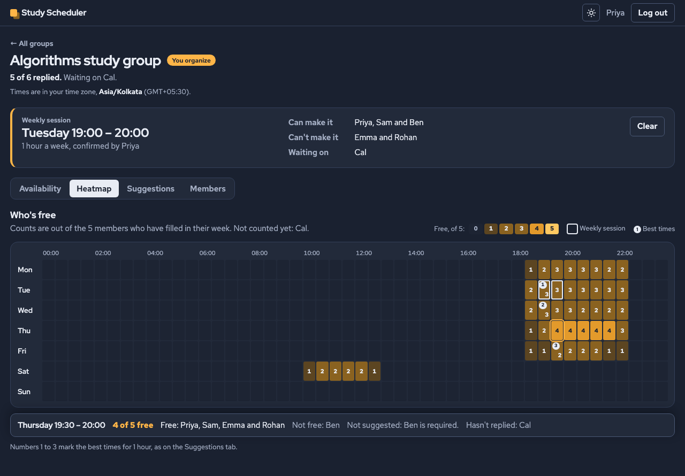
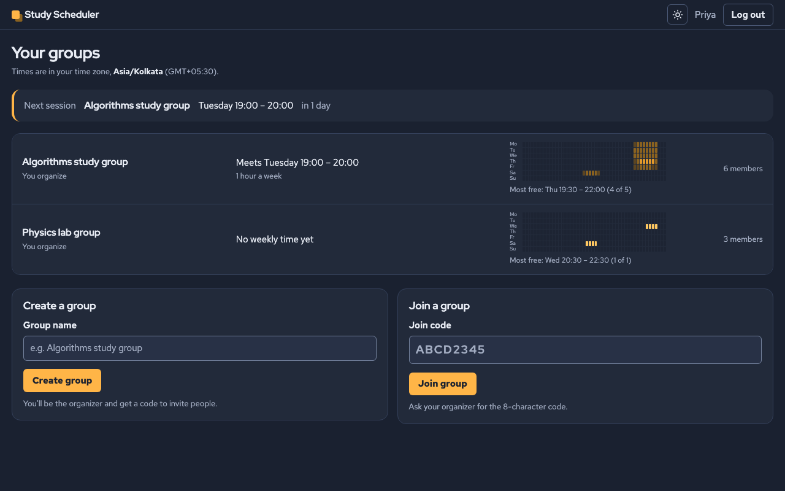
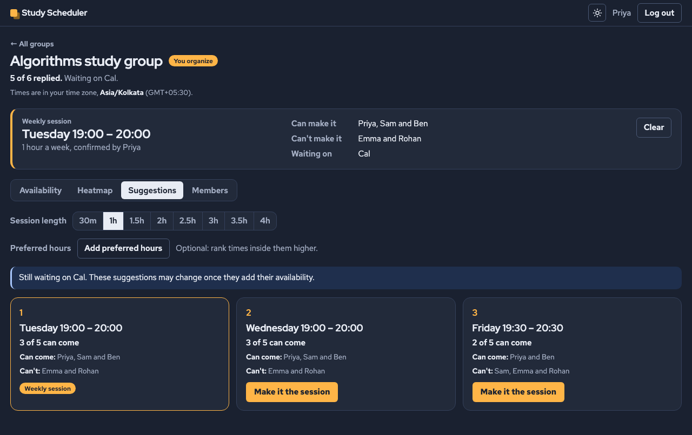
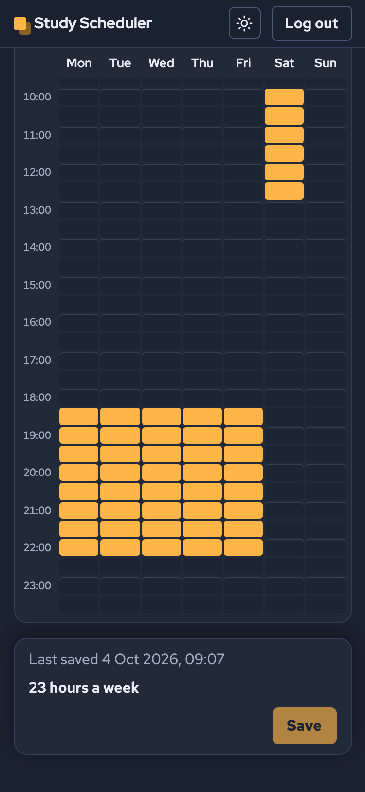
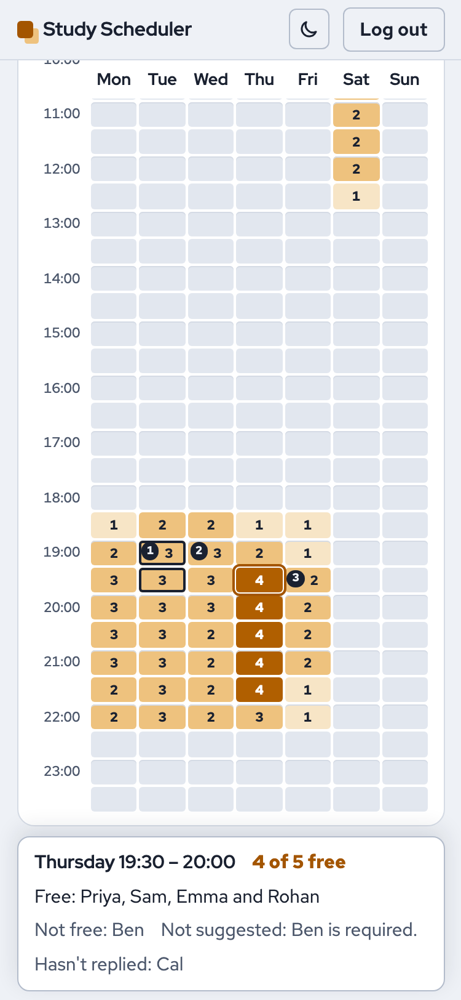
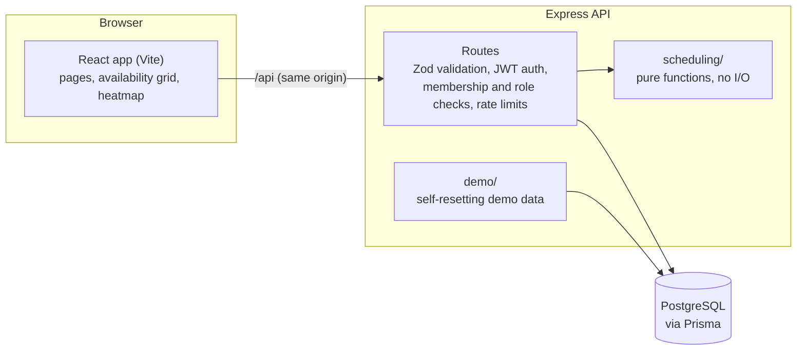

# Study Scheduler

**Find the hour your whole study group can make.** Everyone marks when they're free each week on a
grid. The app suggests the best weekly meeting times: the most people possible, and never without
the people who have to be there. Everyone sees every time in their own time zone.



**Stack:** React (Vite) · Node.js / Express 5 · PostgreSQL · Prisma · Zod · Jest + Supertest ·
Vitest · Playwright · GitHub Actions

> **Live demo: [study-group-scheduler-green.vercel.app](https://study-group-scheduler-green.vercel.app)**.
> Click **Try as organizer** or **Try as member**, no sign-up needed.

## Try the demo

The login page has two one-click buttons, **Try as organizer** and **Try as member**. They open the
same study group, set up to show what the app does:

- **Members in India, London and New York.** The organizer (Priya) is in India and the member
  (Sam) is in London, so the two buttons show the same confirmed session at each person's own
  local time.
- **Someone hasn't replied yet.** Cal never filled in a week, so the group page says
  "Waiting on Cal" and the heatmap counts are out of the 5 members who did.
- **A required member changes the answer.** Thursday evening has the most people free (4 of 5),
  but Ben has to be there and isn't free then, so it isn't suggested. Tap a Thursday cell to see
  "Not suggested: Ben is required.", then make Ben optional on the Members tab and watch
  Thursday become the top suggestion.
- **A confirmed session**, which is also the top suggestion, so the dashboard isn't empty.

Change anything you like. The demo resets itself (see [the demo](#the-self-resetting-demo)).

| Dashboard: each group's week at a glance | Suggestions: the best three times and who can come |
|---|---|
|  |  |

| Marking free time on a phone | Light theme |
|---|---|
|  |  |

## Features

- **Weekly availability grid:** drag to mark free time with a mouse, pen or finger, or use the
  arrow keys and Space. On touch screens the page scrolls normally and a tap toggles a half hour,
  with a "Drag to select" switch for painting. Unsaved changes are kept until you save, and
  leaving asks first.
- **Group heatmap:** every half hour prints how many members are free ("3 of 5"), so colour is
  never the only cue. Hover, tap or focus a half hour to see who's free, who isn't, and who hasn't
  replied.
- **Best times:** the top three windows for a chosen length (30 minutes to 4 hours), ranked by
  attendance, then by your preferred hours, then by earliest in the week. Required members must be
  free; optional ones never block a time.
- **Time zones done properly:** every time is stored in UTC and shown in each user's own zone,
  including half-hour and 45-minute offsets (India, Nepal). Moving to another zone offers "keep the
  same moments" or "keep my local hours".
- **Weekly session:** the organizer confirms a time. Attendance is recalculated whenever anyone's
  availability changes.
- **Organizer controls:** an invite code shown only to the organizer, required or optional members,
  removing members.
- **Light and dark themes**, following the system setting, with a switch in the top bar.

## How it works

### The week and time zones

The week is a circle of 336 half-hour slots, from Monday 00:00 UTC. Availability is stored as
UTC minutes of the week, so a group spread across zones compares like with like. Each user has an
IANA time zone (`Asia/Kolkata`), and the client lays the grid out in that zone. A slot that starts
on Sunday evening in one zone can be Monday morning in another, and a session may run from Sunday
night into Monday.

### Finding the best times

The core is a pure function, [`suggestWindows`](server/src/scheduling/suggestWindows.js), with no
database or HTTP in it.

1. Each member's free slots become a running total (a **prefix sum**) over the week laid out twice.
   "Is this member free for the whole window starting at slot `s`?" is then one subtraction, and
   windows that wrap past Sunday need no special case.
2. Every one of the 336 possible starts is scored in O(members), so a whole week costs
   O(slots × members), whatever the meeting length.
3. Windows where a required member is busy are dropped. The rest are ranked by attendance, then
   overlap with the preferred hours, then earliest start.
4. The best ones are picked greedily so that no two suggestions overlap.

Members who have never saved their week aren't treated as busy: they're left out and listed as
"waiting on", and the suggestions say they may change. A member who saved an empty week counts as
"never free".

## Architecture



```text
client/   React app: pages/, availability/ (grid, heatmap and their pure helpers), time/ (zone
          conversion), theme/, scripts/checkContrast.mjs
server/   Express API: routes/, middleware/, scheduling/ (the algorithm), demo/, prisma/ (schema
          and migrations), tests/unit and tests/api
e2e/      Playwright smoke test
docs/     PLAN.md: the full brief, API reference and every design decision, phase by phase
```

The API reference and the reasoning behind each phase are in [docs/PLAN.md](docs/PLAN.md).

## Design decisions

- **Prefix sums over a doubled week** (above): fast, independent of meeting length, and the week's
  wrap-around costs nothing. A 336-bit mask per member would also work but is harder to read.
- **Never saved is not the same as saved empty.** `Membership.availabilityUpdatedAt` is null until
  the first save, so "hasn't answered" never blocks a time, while "answered: never free" follows
  the normal rules.
- **Non-members get 404, not 403**, for every group route, the same as a group that doesn't exist,
  so sequential ids don't reveal which groups exist. Members who try an organizer-only action get
  403.
- **The join code is shown only to the organizer**, who decides who gets invited.
- **Saving availability is one transaction that updates the membership first.** That row lock
  makes a second save by the same member wait. A concurrency test caught two saves interleaving
  when the update came last.
- **The database enforces the time rules too:** CHECK constraints in the first migration keep
  stored minutes on the 30-minute grid and inside the week, whatever the API does.
- **Password hashes are omitted from every query by default** (Prisma's global `omit`). Only login
  opts in.
- **Preferred hours are in the viewer's own zone, and kept in their browser.** They're a personal
  way to explore the best times, never shown to others.
- **Rate limits are counted in Postgres:** logins and failed join attempts are limited per visitor
  address. The counts live in a small table, so every serverless instance shares them, and each
  hit is one atomic SQL statement. Behind Vercel's edge (one trusted proxy), `req.ip` is the
  visitor's own address, and an IPv6 visitor is counted by /56 subnet.
- **Accessibility:** counts are printed in the heatmap, everything works from the keyboard, and
  `npm run contrast` checks WCAG AA for every colour pair in both themes, in CI.

### The self-resetting demo

- **When it resets:** when a server instance starts or someone opens the demo, but only if the
  last reset was 30+ minutes ago. That time is kept in the database, so a new serverless instance
  never wipes a visitor's recent changes, and two visitors exploring at once don't wipe each
  other's work.
- **What a reset restores:** one transaction restores the demo users (time zones, passwords) and
  the demo groups' contents (availability, required flags, removed members, the session). It also
  deletes groups visitors created.
- **Pages keep working through a reset:** users and groups keep their ids, so a visitor who is
  looking at a demo group just sees fresh data.
- **It's a closed world:** demo accounts can't join other groups, and nobody can join a demo group,
  so a reset can never touch a real user's data.

## Testing

| Suite | What it covers | Count |
|---|---|---|
| Server (Jest + Supertest) | Unit: the scheduling algorithm, including a check against a deliberately naive version on many random groups; ranges; time zone shifts. API: every route on a real PostgreSQL test database, covering validation, auth, the access rules for every group route, concurrency and the demo | 344 |
| Client tests (Vitest) | The pure helpers behind the grid, heatmap, time zones, settings and theme | 101 |
| End-to-end (Playwright) | A visitor opens the demo, sees the dashboard, the group and the best times | 1 |
| Contrast check | WCAG AA for every colour pair the components use, in both themes | 58 pairs |

The tests use their own database and refuse to run against one whose name doesn't end in `_test`.
While building, each protection was also broken on purpose to check that a test fails.
GitHub Actions runs everything on every push: server lint and tests, client lint, tests, contrast
and build, and the end-to-end test.

## Known trade-offs

- **Daylight saving time.** Weekly availability is stored in UTC. When a member's clocks change,
  their saved hours move by an hour on their own calendar until they adjust them. Zones without
  DST, like India, never see this. Storing local times would push the problem onto everyone
  else's view instead.
- **The login token is kept in `localStorage`.** It's simple and works across tabs, but script
  injection could read it. React escapes all output and the app loads no third-party scripts. An
  httpOnly cookie would be the next step.
- **`npm audit` reports a high-severity issue in the Prisma CLI's `deepmerge-ts`.** The CLI is only
  used at build time, so the issue isn't reachable from the running app. The suggested fix
  downgrades Prisma.
- **One confirmed session per group.**
- **The demo's password is public, by design**, and a visitor's changes last until the next demo
  login 30+ minutes later.

## Run it locally

You need Node.js 22+ and PostgreSQL.

```bash
git clone https://github.com/Seshasai-Tunuguntla/study-group-scheduler.git
cd study-group-scheduler

# API on http://localhost:4100
cd server
cp .env.example .env            # then set DATABASE_URL and JWT_SECRET
npm install
npx prisma migrate deploy
npm run dev                     # also creates the demo accounts

# Client on http://localhost:5180 (in a second terminal)
cd client
npm install
npm run dev
```

| Where | Command | What it does |
|---|---|---|
| `server/` | `npm test` | Jest, against the test database: create `server/.env.test` with a `DATABASE_URL` ending in `_test` (its migrations run automatically) |
| `server/` | `npm run demo:reset` | Rebuilds the demo data now |
| `client/` | `npm test` | Vitest |
| `client/` | `npm run contrast` | The WCAG contrast check |
| `e2e/` | `npm install && npm test` | Builds the client, starts the API and client on their own ports with their own database (`study_scheduler_e2e`, on the server in `server/.env`), and runs the smoke test in your installed Google Chrome |

## Deployment

One Vercel project serves the client's static build and runs the API as a Vercel Function, with the
database on Neon ([`vercel.json`](vercel.json), [`api/index.js`](api/index.js)):

- `/api/*` goes to the Express app, and every other path to the React app. The client and the API
  share one domain, so there's no CORS setup, and the API sees each visitor's real address.
- The build applies database migrations over Neon's direct connection. The app uses the pooled
  one.
- A new instance checks once whether the demo is due for a reset before its first request.
- **Preview deployments never touch the production database.** The database settings are scoped
  to Production only. As a safety net, a preview build also skips migrations, and a preview's API
  answers 503 without connecting to any database, unless `PREVIEW_HAS_OWN_DATABASE=true` says it
  has its own (for example a Neon preview branch).

Why Vercel rather than Render, and every serverless change, are in
[docs/PLAN.md](docs/PLAN.md#phase-12-decisions-deployment).
